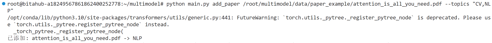
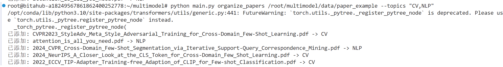
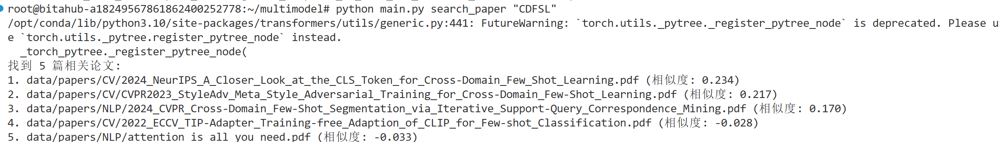
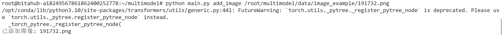
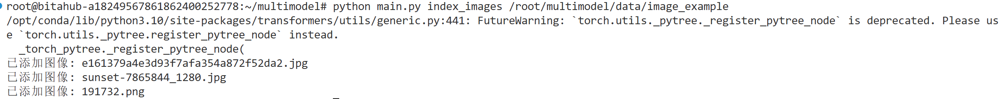
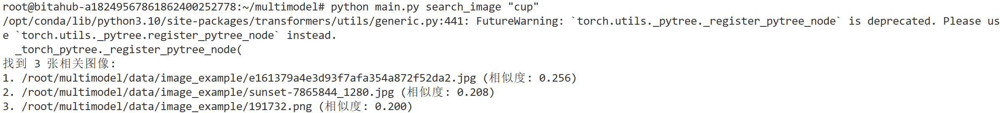
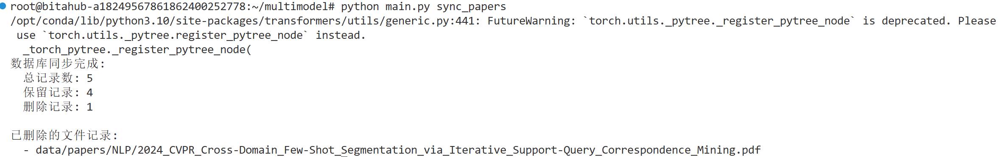

# 本地 AI 智能文献与图像管理助手

实现了基于多模态神经网络的本地智能助手，实现文献和图像的语义搜索与自动分类。

## 项目简介

本项目是一个 Python 本地多模态 AI 智能助手，解决本地大量文献和图像素材管理困难的问题。利用多模态神经网络技术，实现对内容的**语义搜索**和**自动分类**，无需依赖传统的文件名匹配。

## 核心功能

### 1. 智能文献管理
- **语义搜索**: 使用自然语言提问查找相关论文
- **自动分类**: 添加新论文时自动分析内容并归类到指定主题文件夹
- **批量整理**: 一键整理混乱文件夹，自动扫描所有 PDF 并归档
- **文件索引**: 快速定位所需文献

### 2. 智能图像管理
- **以文搜图**: 通过自然语言描述（如"海边的日落"）查找本地图片库中的匹配图像
- **批量索引**: 自动索引图像文件夹中的所有图片


## 环境配置

### 系统要求
- Python 3.8+
- 推荐使用 GPU

### 依赖安装

```bash
pip install -r requirements.txt
```

### 首次运行

首次运行时会自动下载模型文件（约 500MB），请确保网络连接稳定：
- `all-MiniLM-L6-v2`: ~80MB
- `clip-vit-base-patch32`: ~350MB

## 详细使用说明

### 1. 添加单个论文并分类

```bash
python main.py add_paper /path/to/paper.pdf --topics "CV,NLP"
```
**示例**:



https://github.com/user-attachments/assets/848393d3-9a40-405c-afc4-1088cda20fd3


**说明**: 
- 系统会提取 PDF 内容，自动判断其属于哪个主题（CV/NLP），并移动到对应文件夹
- 同时建立语义索引，支持后续搜索

### 2. 批量整理论文文件夹

```bash
python main.py organize_papers /path/to/messy_folder --topics "CV,NLP"
```
**示例**:



https://github.com/user-attachments/assets/4134eb8a-53b6-4d97-b315-f2fbc09db2a3


**说明**: 
- 自动扫描指定文件夹中所有 PDF 文件
- 根据内容分类到 `data/papers/CV/`、`data/papers/NLP/` 等子文件夹
- 建立完整的语义索引

### 3. 语义搜索论文

```bash
python main.py search_paper "xxxx"
```
**示例**:



https://github.com/user-attachments/assets/9bb35530-fc49-4b0e-94ee-aa05e76066bc


### 4. 添加图像到索引

```bash
python main.py add_image /path/to/sunset.jpg
```
**示例**:



https://github.com/user-attachments/assets/aa179274-5194-450e-9728-a6136aeda098


### 5. 批量索引图像文件夹

```bash
python main.py index_images /path/to/image_folder
```
**示例**:



https://github.com/user-attachments/assets/e87f6d43-e40a-4414-929f-64db25d74e1e


### 6. 以文搜图

```bash
python main.py search_image "cup"
```

**示例**:



https://github.com/user-attachments/assets/c49701fe-c9f7-4e9f-83b8-6d019f72ca21


### 7. 更新论文索引

```bash
python main.py sync_papers
```
**示例**:



https://github.com/user-attachments/assets/305d9ac5-ccf1-4bc8-9de0-fd90248f8248


**说明**: 
- 由于会存在索引错误的情况，因此支持将文件夹中的论文进行调整和更新


## 目录结构

```
multimodel/
├── main.py              # 主入口文件
├── paper_manager.py     # 论文管理模块
├── image_manager.py     # 图像管理模块
├── requirements.txt     # 依赖列表
├── README.md           # 说明文档
└── data/               # 数据目录（自动创建）
    ├── papers/         # 论文存储
    │   ├── chroma_db/  # 论文向量数据库
    │   ├── CV/         # 分类后的论文文件夹
    │   └── NLP/
    └── images/         # 图像存储
        └── chroma_db/  # 图像向量数据库
```

## 命令速查表

| 命令 | 功能 |
|------|------|
| `add_paper` | 添加并分类单个论文 |
| `organize_papers` | 批量整理论文文件夹 |
| `search_paper` | 语义搜索论文 | 
| `add_image` | 添加图像到索引 | 
| `index_images` | 批量索引图像 | 
| `search_image` | 以文搜图 |

